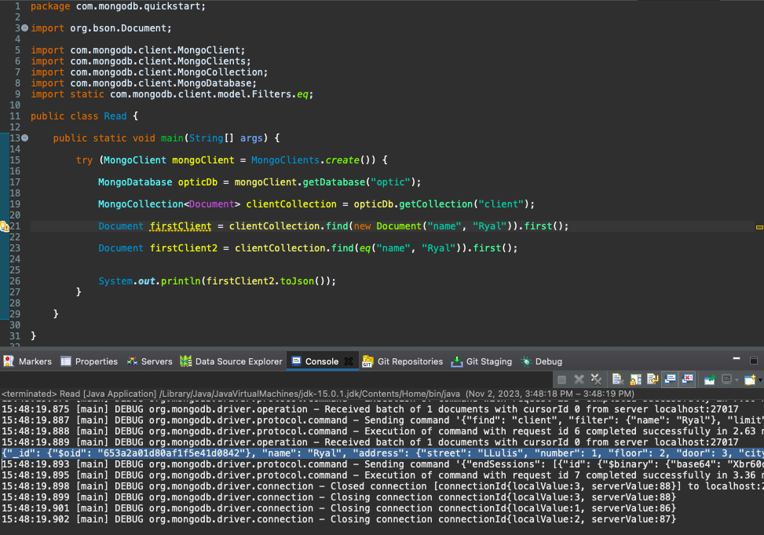

# Sprint2_T4_MongoDB_Java

It tests the set up for Java project with Maven and execute a MongoDB command, exploring the most CRUD operations using the MongoDB Java driver.

It follows: https://www.mongodb.com/developer/languages/java/java-setup-crud-operations/

#### Create

###### Insert one

###### Insert multiple

#### Read

###### Specfic document

###### Range of documents (by list)

###### Range of documents (by iterator)

###### Range of documents (by Consumer functional interface implementation)

#### Update

###### Update one

_There is others update operators examples:_
- **set** will set a value.
- **inc** will increment a value.
- **rename** will rename a field.
- **mul** will multiply the value by the given number.
- **addToSet** is similar to push but will only push the value in the array if the value doesn't exist already.

#### Delete

